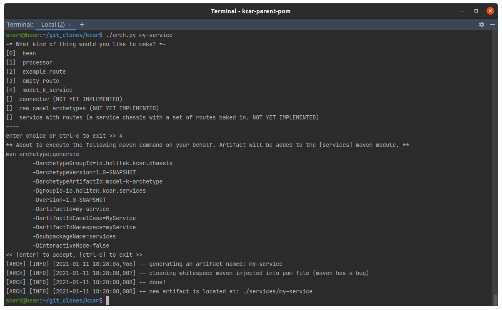
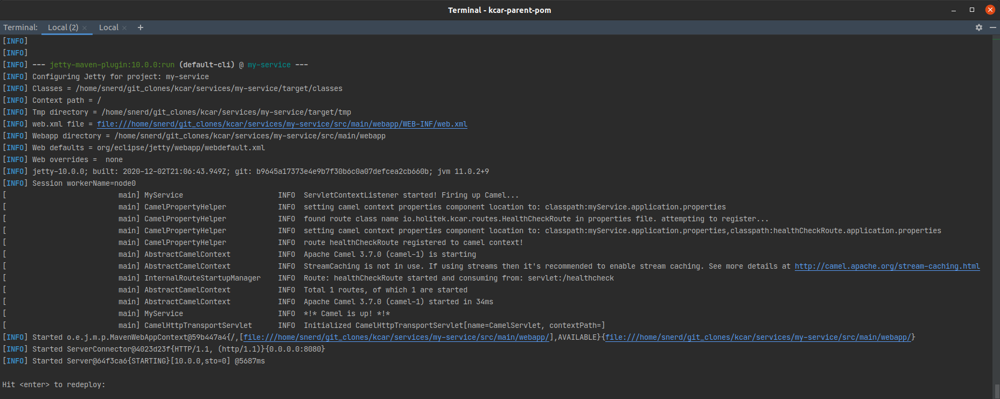
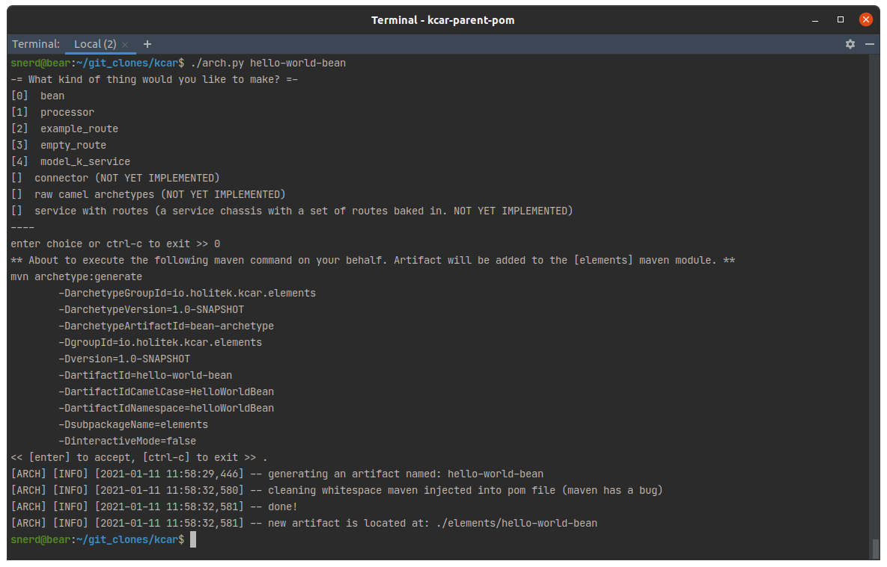
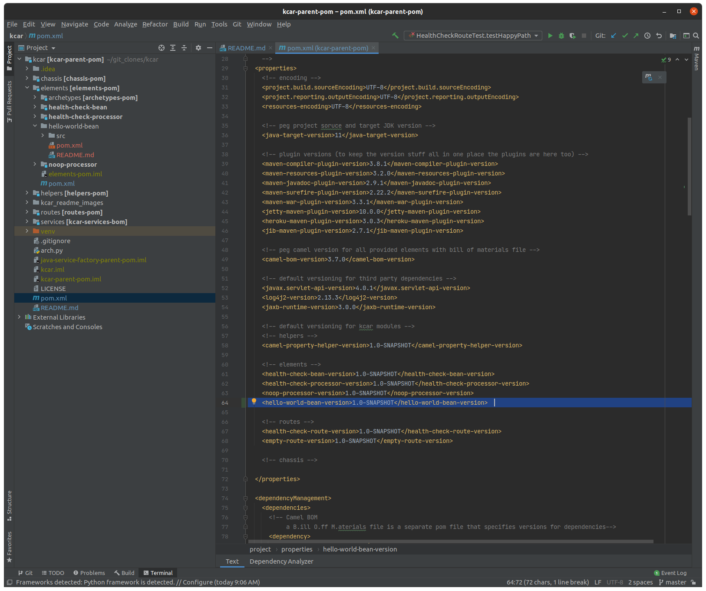
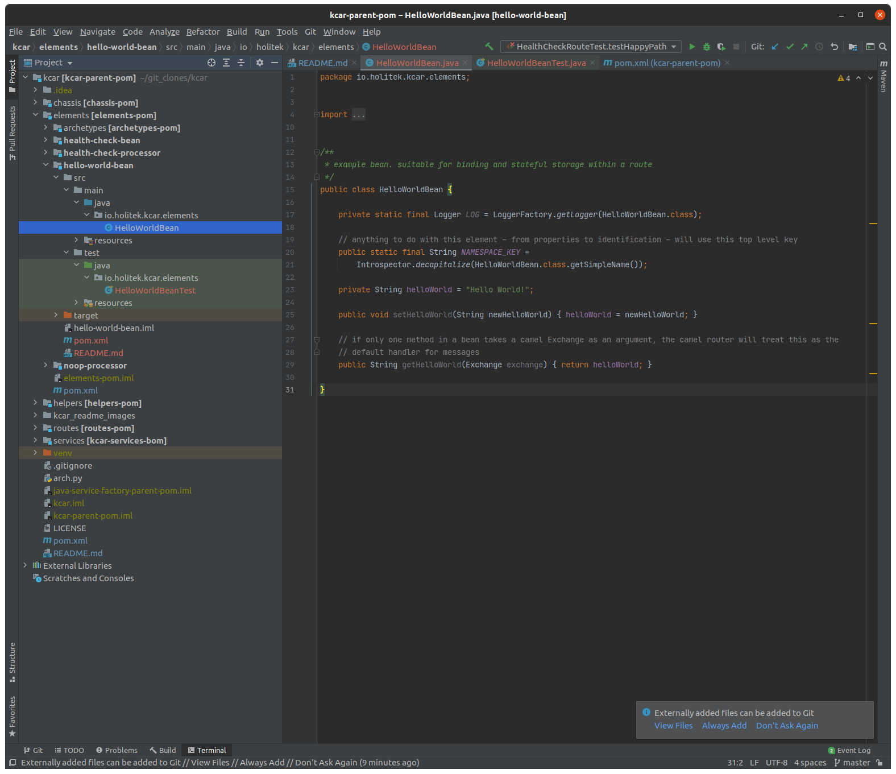
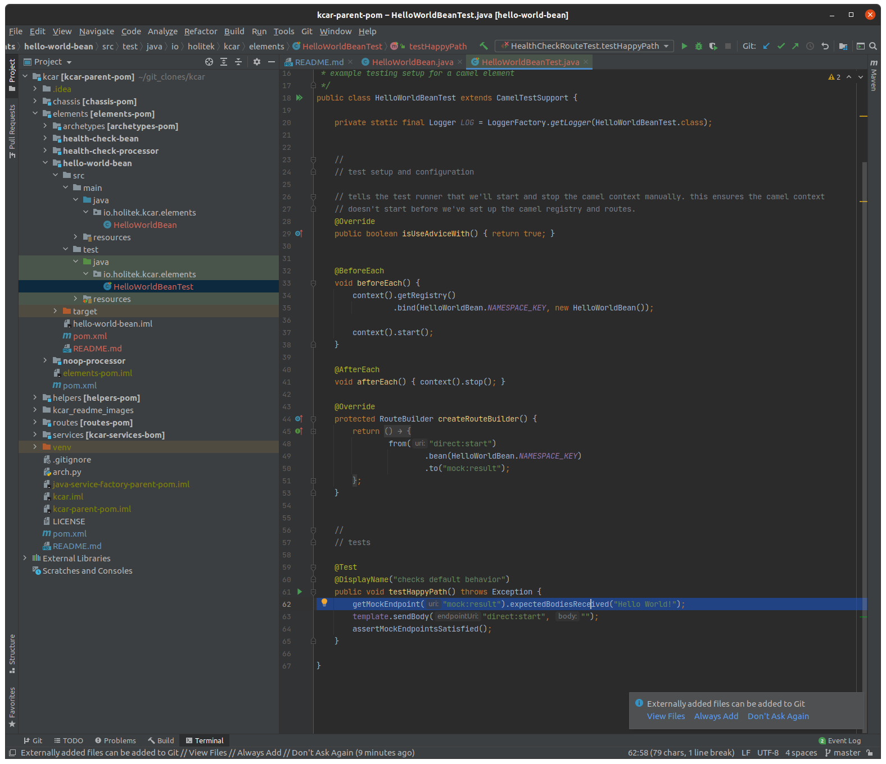
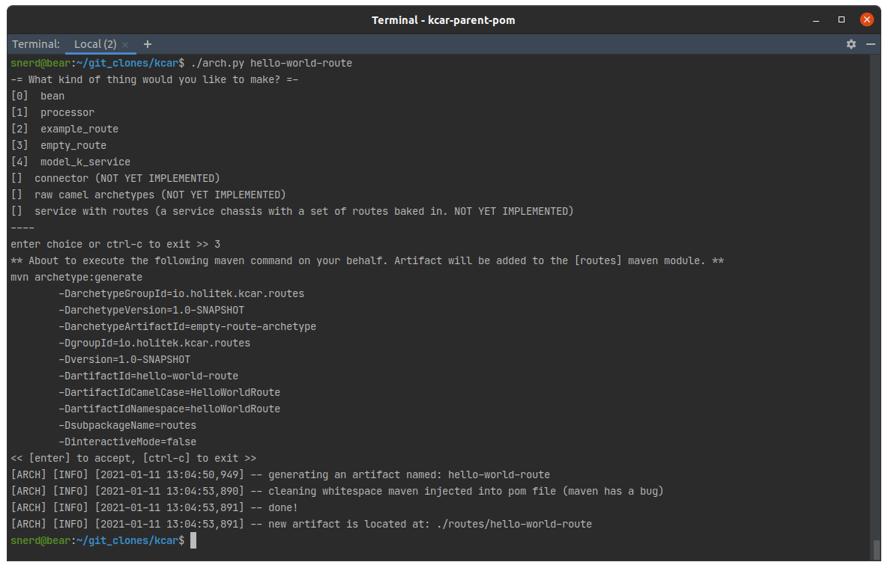
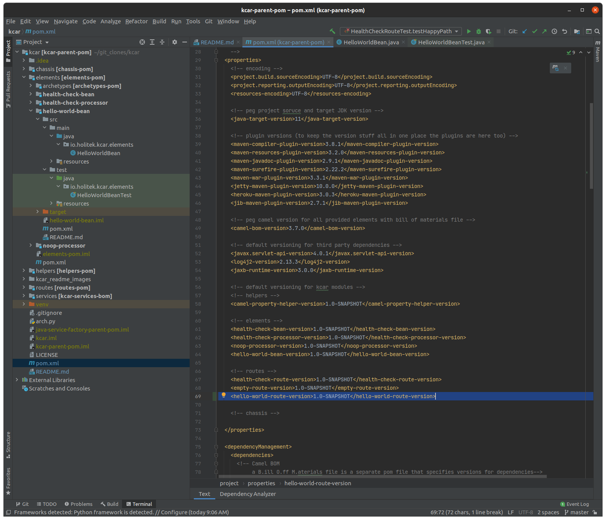

# K-car
### a factory for building and deploying Java microservices 


## contents
- [what is this?](#what-is-this)
- [prerequisites](#prerequisites)
- [key concepts](#key-concepts)
- [quickstart](#quickstart)
- [longer quickstart](#longer-quickstart)
- [important project conventions](#important-project-conventions)
- [how do I?](#how-do-i)
- [available service chassis](#available-service-chassis)
- [todo](#todo)
- [notes](#notes)


## what is this? 
K-car is a fast, flexible, way to microservice. It uses [Apache Camel](https://camel.apache.org/) to empower teams to quickly deliver complex business logic in a way scales. 

Units of business logic, compositions of business logic, and the service platform on which those compositions are deployed, are all 100% encapsulated. This allows:

* engineers to work independently.
  
* for every element in the assembly to have its own properties file.
  
* for every element in the assembly to have its own robust set of tests.
  
* for elements to be re-used without cutting and pasting source from one project to another. 

It accomplishes this by using a feature of the build tool, [Maven](https://maven.apache.org/), that allows for project source code to be instanced in much the same way an OOP developer would create an instance of a class. When combined with a framework that's highly modular like Camel, the result is something in which your build artifacts are highly modular as well. This allows work to be distributed more easily across an engineering org because work is readily decomposed into something that allows everyone to work and share through the lens of neatly-encapsulated units of work. 

As a process it also scales for the same reason -and- the paradigm facilitates re-use of components in exactly the same way Java developers already do so via stores like [Maven Central](https://search.maven.org/).

The project is called __K-car__ in honor of [Chrysler's K platform](https://en.wikipedia.org/wiki/Chrysler_K_platform) from which the idea of rapidly building microservices from a collection of standardized, encapsulated, components is derived. 

[back to contents](#contents)


## prerequisites

__stack prerequisites__
* maven 3
* java 11
* python3 (for the helper script `arch.py`)
* docker 

[SDK-man](https://sdkman.io/) is an excellent way to install maven and java. Python3 is almost certainly already installed on your workstation but here's a [link](https://www.python.org/downloads/) jik. The script that requires it does not require any special libraries so there's no need to stand up a venv. Docker can be installed from their [website](https://www.docker.com/products/docker-desktop). 

__knowledge prerequisites__
* apache camel 
* Enterprise Integration Patterns 

Working knowledge of Apache Camel is a must - though if you're a Java developer already you'll grok Camel very quickly. These will get you started: [link](https://camel.apache.org/manual/latest/faq/what-is-camel.html), [link](https://www.baeldung.com/apache-camel-intro). 

As for the EIPs, because Camel is a tool for implementing those patterns, it would be helpful if you knew enough about them to understand the naming conventions (ie - what a processor is, what a route is, etc). This is a as good a synopsis as any: [link](https://www.enterpriseintegrationpatterns.com/patterns/messaging/).

[back to contents](#contents)


## key concepts

#### element
An element is a single unit of business logic. Examples in code are [endpoints](https://camel.apache.org/manual/latest/endpoint.html), [processors](https://camel.apache.org/manual/latest/processor.html), and [beans](https://camel.apache.org/components/latest/eips/bean-eip.html). Conceptually, an element is any business logic that would normally be represented in a single java object. An EIP example would be a translator:


#### route
A route is a collection of elements strung together to represent complex business logic. In code, they are represented by camel [RouteBuilder](https://camel.apache.org/manual/latest/routes.html) instances. Conceptually, a route can be represented as an EIP pattern. For example:


#### chassis 
A chassis is a ready-bake service into which routes are inserted. While different service chassis come with different things, they all are deployable out of the box. See [available service chassis](#available-service-chassis) for more detail. 

#### service
A service is an instance of a given chassis. It is what you put your routes into and deploy to wherever you deploy your stuff to. New routes are inserted into a chassis by properties file. 

[back to contents](#contents)


## quickstart 
This will walk you through the process of creating deploying a bare-bones service using the `model-k` service chassis. 

### create the service
1. at the command line, from the project root directory, invoke the builder script:
```shell
{KCAR_PROJECT_ROOT}$ ./arch.py my-service  
```
you will be asked what kind of thing you want to make. Enter `[4]` to create a new service. You will then be asked to confirm that the maven command that was generated on your behalf is correct. Hit `return` to confirm. 


2. navigate to `{KCAR_PROJECT_ROOT}/services/my-service` and build the service:
```shell
{KCAR_PROJECT_ROOT}/services/my-service$ mvn clean install
```

This will instruct maven to build the project, run the tests, and create build artifacts in the form of both a WAR file and a docker image. 


### start the service locally 

3a. One way to do this is to use the jetty plugin:
```shell
{KCAR_PROJECT_ROOT}/services/my-service$ mvn jetty:run
```

3b. Another is to use the docker image created as part of the build. We need to expose port 8080 as that's the default service port the chassis will use:
```shell
{KCAR_PROJECT_ROOT}/services/my-service$ docker run -p 8080:8080 my-service 
```

Regardless of your chosen method, you should end up with something that looks like this on your terminal:



If you make an HTTP GET request against `http://localhost:8080/healthcheck` you should get an OK response:


[back to contents](#contents)


## longer quickstart 
This will walk you through the process of building and deploying a service that exposes a REST endpoint `/helloworld` that returns a `hello world!` response. 

### make the element
1. If you haven't already done so, clone this repository and check out the prerequisite section of this doc to ensure you've got all the things. 

2. At the command line, from the root project directory, build all the things with `mvn clean install`. 

3. Run the builder script to create a new element `./arch.py hello-world-bean`. You will be presented with a menu asking you what kind of thing you want to make. Select `0` for `bean`. It will then ask you to confirm a maven command that will be executed on your behalf. Press `[enter]` to accept. 

   
4. The runner script executed a maven command on your behalf to create an instance of the `bean archetype` named `hello-word-bean` a sub-project of the `elements` module. While not 100% necessary, best practice is to add the version of the newly created bean to the project parent pom file to ensure anyone other route that employs the newly created bean will also use the current 'release' version of it. *NOTE* This step will be automated in a future release. 

   
5. update the bean and bean test to respond with 'hello world!' instead of 'foo'

update the bean

   
update the test



5. Build and install the new bean into your local maven repository. from the `./kcar/elements/hello-world-bean` directory execute the terminal command `mvn clean install`. If something goes wrong - check to make sure you've updated both the bean and the unit test correctly. 

### make the route 

6. At this point you've created a unit of business logic. Now it's time to incorporate that logic into a route that exposes it as a REST endpoint. As you did to create the bean, execute builder script to create a new route `arch.py hello-world-route` (select `[3]` for empty-route)

   
7. As you did with the bean, add the version to the properties section of the project parent pom (and again - this step will be automated in a future release - promise!)

   
8. 


[back to contents](#contents)


## important project conventions 

* project build files

* namespacing and properties

[back to contents](#contents)

## how do I?

* make a new element?

* make a new route?

* make a new service?

* run a service locally 

* use a service's docker image locally

* deploy a service to heroku? 

* integrate with Spring?

* handle dependency injection?

[back to contents](#contents)

## available service chassis 

#### model-k
The model-k chassis is named for the [Kalashnikov rifle](https://en.wikipedia.org/wiki/Kalashnikov_rifle). It is intended to be as simple as possible, as robust as possible, and use the smallest set of dependencies. As such it uses the [Jakarta servlet](https://en.wikipedia.org/wiki/Jakarta_Servlet) interface directly (vs using a framework like Spring). Note that Camel natively supports JNDI and configuration-based routing so effectively, Spring isn't necessary for dependency injection. 

The model-k chassis comes with the following features: 
* ability to be deployed to any servlet container as a WAR file.
  * this includes automated deployment to a heroku slug via maven plugin. See [this](https://devcenter.heroku.com/articles/deploying-java-applications-with-the-heroku-maven-plugin) for more detail. 
* automated creation of a [distroless](https://github.com/GoogleContainerTools/distroless) docker image, suitable for production deployment, at build time via [Google Jib](https://github.com/GoogleContainerTools/jib). Jib has several nifty features that give you prod-ready docker images without a lot of fuss. See [this](https://cloud.google.com/blog/products/gcp/introducing-jib-build-java-docker-images-better) for more detail. 
* ability to add routes via configuration file.
* dependency injection w/o Guice or Spring.
* ability to run locally either via the docker image or jetty plugin.
* JUnit5 test support.
* grab-bag of QA plugins to handle linting, testing, and doc generation.
  
#### model-sb (not yet implemented)
The model-sb will SpringBoot vs native Java or Camel components. In effect, it's a Camel service using SpringBoot for all the deeper layer Java things.  

[back to contents](#contents)

## todo
in no particular order...
* error handling for health check route (dead letter channel)
* add sample IT test to service chassis archetype that uses Docker 
* ensure logging configuration for all project components is sensible and consistent 
* investigate 'ivy-httpclient-shutdown-handler' noise that sometimes pops up during builds 
* add remaining archetypes to runner script
* update runner script to be a full CLI
* add hooks into pom files to ensure test reports are aggregated and readily available for jenkins (or whatever) to parse
* update runner script to add version information to global parent pom on module creation  
* update runner script to remove components from poms
* update runner script to manage project component versions 
* add service chassis that uses Spring

[back to contents](#contents)

## notes 

This project is the successor to an earlier project called [camel-harness](https://github.com/davidholiday/camel-harness). Many of the ideas developed in that project are here in some form. 

[back to contents](#contents)
