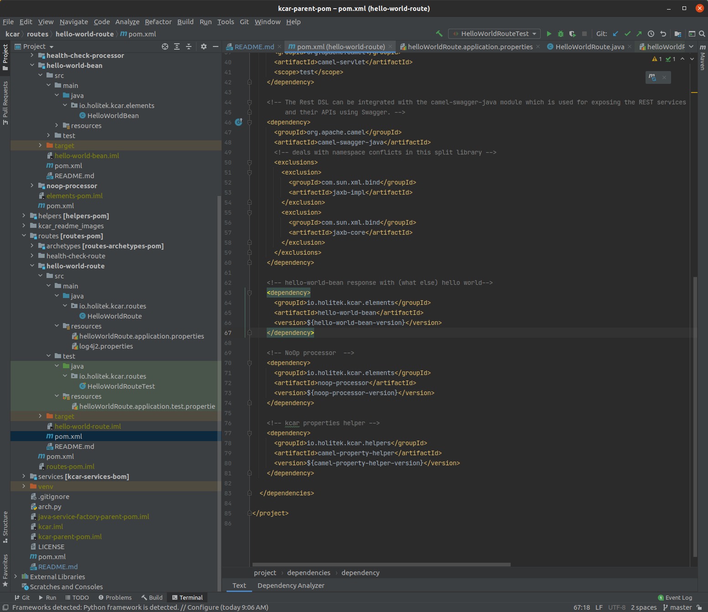
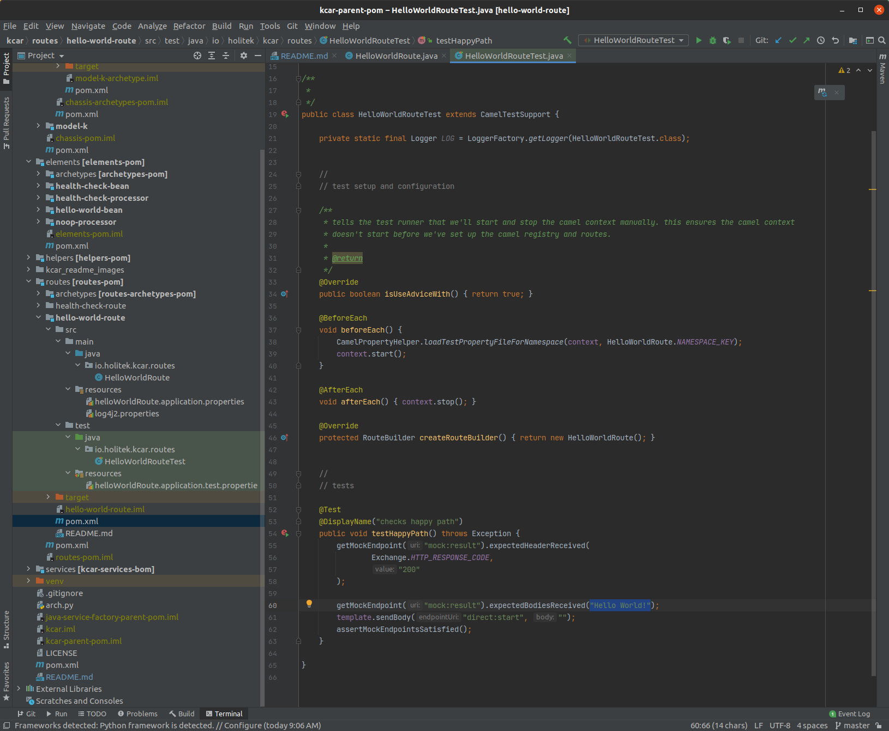

# K-car
### a factory for building and deploying Java microservices 


## contents
- [what is this?](#what-is-this)
- [prerequisites](#prerequisites)
- [key concepts](#key-concepts)
- [quickstart](#quickstart)
- [longer quickstart](#longer-quickstart)
- [important project conventions](#important-project-conventions)
- [how do I?](#how-do-i)
- [available service chassis](#available-service-chassis)
- [todo](#todo)
- [notes](#notes)


## what is this? 
K-car is a fast, flexible, way to microservice. It uses [Apache Camel](https://camel.apache.org/) to empower teams to quickly deliver complex business logic in a way scales. 

Units of business logic, compositions of business logic, and the service platform on which those compositions are deployed, are all 100% encapsulated. This allows:

* engineers to work independently.
  
* for every element in the assembly to have its own properties file.
  
* for every element in the assembly to have its own robust set of tests.
  
* for elements to be re-used without cutting and pasting source from one project to another. 

It accomplishes this by using a feature of the build tool, [Maven](https://maven.apache.org/), that allows for project source code to be instanced in much the same way an OOP developer would create an instance of a class. When combined with a framework that's highly modular like Camel, the result is something in which your build artifacts are highly modular as well. This allows work to be distributed more easily across an engineering org because work is readily decomposed into something that allows everyone to work and share through the lens of neatly-encapsulated units of work. 

As a process it also scales for the same reason -and- the paradigm facilitates re-use of components in exactly the same way Java developers already do so via stores like [Maven Central](https://search.maven.org/).

The project is called __K-car__ in honor of [Chrysler's K platform](https://en.wikipedia.org/wiki/Chrysler_K_platform) from which the idea of rapidly building microservices from a collection of standardized, encapsulated, components is derived. 

[back to contents](#contents)


## prerequisites

__stack prerequisites__
* maven 3
* java 11
* python3 (for the helper script `arch.py`)
* docker 

[SDK-man](https://sdkman.io/) is an excellent way to install maven and java. Python3 is almost certainly already installed on your workstation but here's a [link](https://www.python.org/downloads/) jik. The script that requires it does not require any special libraries so there's no need to stand up a venv. Docker can be installed from their [website](https://www.docker.com/products/docker-desktop). 

__knowledge prerequisites__
* apache camel 
* Enterprise Integration Patterns 

Working knowledge of Apache Camel is a must - though if you're a Java developer already you'll grok Camel very quickly. These will get you started: [link](https://camel.apache.org/manual/latest/faq/what-is-camel.html), [link](https://www.baeldung.com/apache-camel-intro). 

As for the EIPs, because Camel is a tool for implementing those patterns, it would be helpful if you knew enough about them to understand the naming conventions (ie - what a processor is, what a route is, etc). This is a as good a synopsis as any: [link](https://www.enterpriseintegrationpatterns.com/patterns/messaging/).

[back to contents](#contents)


## key concepts

#### element
An element is a single unit of business logic. Examples in code are [endpoints](https://camel.apache.org/manual/latest/endpoint.html), [processors](https://camel.apache.org/manual/latest/processor.html), and [beans](https://camel.apache.org/components/latest/eips/bean-eip.html). Conceptually, an element is any business logic that would normally be represented in a single java object. An EIP example would be a translator:


#### route
A route is a collection of elements strung together to represent complex business logic. In code, they are represented by camel [RouteBuilder](https://camel.apache.org/manual/latest/routes.html) instances. Conceptually, a route can be represented as an EIP pattern. For example:


#### chassis 
A chassis is a ready-bake service into which routes are inserted. While different service chassis come with different things, they all are deployable out of the box. See [available service chassis](#available-service-chassis) for more detail. 

#### service
A service is an instance of a given chassis. It is what you put your routes into and deploy to wherever you deploy your stuff to. New routes are inserted into a chassis by properties file. 

[back to contents](#contents)


## quickstart 
This will walk you through the process of creating a bare-bones service using the `model-k` service chassis. The end result will be both a WAR file and a docker image - both suitable for deployment. If you haven't already done so, clone this repository, check out the prerequisite section of this doc to ensure you've got all the things, and build the project:

```shell
{KCAR_PROJECT_ROOT}$ mvn clean install
```
---
### create the service
1. __At the command line, from the project root directory, invoke the factory script:__
```shell
{KCAR_PROJECT_ROOT}$ ./arch.py my-service  
```
you will be asked what kind of thing you want to make. Enter `[4]` to create a new service. You will then be asked to confirm that the maven command that was generated on your behalf is correct. Hit `return` to confirm. 


2. __Navigate to `{KCAR_PROJECT_ROOT}/services/my-service` and build the service:__
```shell
{KCAR_PROJECT_ROOT}/services/my-service$ mvn clean install
```

This will instruct maven to build the project, run the tests, and create build artifacts in the form of both a WAR file and a docker image. 


---
### start the service locally 

3a. __One way to do this is to use the jetty plugin:__
```shell
{KCAR_PROJECT_ROOT}/services/my-service$ mvn jetty:run
```

3b. __Another is to use the docker image created as part of the build. We need to expose port 8080 as that's the default service port the chassis will use:__
```shell
{KCAR_PROJECT_ROOT}/services/my-service$ docker run -p 8080:8080 my-service 
```

Regardless of your chosen method, you should end up with something that looks like this on your terminal:


If you make an HTTP GET request against `http://localhost:8080/healthcheck` you should get an OK response:


[back to contents](#contents)


## longer quickstart 
This will walk you through the process of building a custom service that exposes a REST endpoint `/helloworld` that returns a `hello world!` response. If you haven't already done so, clone this repository, check out the prerequisite section of this doc to ensure you've got all the things, and build the project:

```shell
{KCAR_PROJECT_ROOT}$ mvn clean install
```

---
### make the element

2. __Run the factory script to create a new element:__ 
   
```shell
{KCAR_PROJECT_ROOT}$ ./arch.py hello-world-bean
```
You will be presented with a menu asking you what kind of thing you want to make. Select `[0]` for `bean`. It will then ask you to confirm a maven command that will be executed on your behalf. Press `[enter]` to accept. 

 
  
3. __The runner script executed a maven command on your behalf to create an instance of the `bean archetype` named `hello-word-bean` as sub-project of the `elements` module. While not 100% necessary, best practice is to add the version of the newly created bean to the project parent pom file located at `{KCAR_PROJECT_ROOT}/pom.xml` to ensure anyone other route that employs the newly created bean will also use the current 'release' version of it. *NOTE* This step will be automated in a future release.__ 

```xml
<hello-world-bean-version>1.0-SNAPSHOT</hello-world-bean-version>
```


   

4. __Update the bean and bean test to respond with 'hello world!' instead of 'foo'__

* in the file `{KCAR_PROJECT_ROOT}/elements/hello-world-bean/src/main/java/io/holitek/kcar/elements/HelloWorldBean.java` update the bean getters and setters to and method names as per the screenshot:


   

* In the file `{KCAR_PROJECT_ROOT/elements/hello-world-bean/src/test/java/io/holitek/kcar/elements/HelloWorldBeanTest.java`, update the test method `testHappyPath()` to expect the bean to produce the string 'Hello World!' instead of 'foo':


5. __Build and install the new bean into your local maven repository. If something goes wrong - check to make sure you've updated both the bean and the unit test correctly.__
```shell
{KCAR_PROJECT_ROOT}/elements/hello-world-bean$ mvn clean install
```


---
### make the route 

6. __At this point you've created a unit of business logic. Now it's time to incorporate that logic into a route that exposes it as a REST endpoint. As you did to create the bean, execute builder script to create a new route `{KCAR_PROJECT_ROOT}/arch.py hello-world-route` (select `[3]` for empty-route)__

   

7. __As you did with the bean, add the version to the properties section of the project parent pom (and again - this step will be automated in a future release - promise!)__

```xml
<hello-world-route-version>1.0-SNAPSHOT</hello-world-route-version>
```


   

8. __As you did with the bean, build the project. (If maven complains about not being able to resolve `health-check-bean-version`, build the project from {KCAR_PROJECT_ROOT} using the root pom file):__
```shell
{KCAR_PROJECT_ROOT}/routes/hello-world-route$ mvn clean install
```

9. __Add the `hello-world-bean` to the project pom file *NOTE* this will be automated in a future release.__ 

Open file `{KCAR_PROJECT_ROOT}/routes/hello-world-route/pom.xml` and add the following to the `<dependencies>` block:

```xml
    <!-- hello-world-bean response with (what else) hello world-->
    <dependency>
      <groupId>io.holitek.kcar.elements</groupId>
      <artifactId>hello-world-bean</artifactId>
      <version>${hello-world-bean-version}</version>
    </dependency>
```

for example:



10. __Add the bean name to both the default and test properties files:__
    
Note that these files are what controls the flow of logic within a K-car route and do not necessarily need to be the same. For example, the test properties file can define a mock whereas the default properties file defines the production artifact.
    
Also note that both the properties files and the elements within the files are namespaced. The namespace is automatically generated when the factory script generates the project component. In this way each artifact can specify for itself what properties it will run by without risk of namespace collision between different elements that happen to be put in the same service. If those properties need to be overridden, they can be at the service level. 
    
What you need to add is:
* `helloWorldRoute.helloWorldBean = bean:io.holitek.kcar.elements.HelloWorldBean`
    
The files you need to add the above KV pair to are located at:
* `{KCAR_PROJECT_ROOT}/routes/hello-world-route/src/main/java/resources/helloWorldRoute.application.properties`   
* `{KCAR_PROJECT_ROOT}/routes/hello-world-route/src/test/java/resources/helloWorldRoute.application.test.properties` 

Additionally, we need to update the default properties file `helloWorldRoute.application.properties` to listen on REST endpoint `/helloworld` instead of `/empty`. Change the `entrypoint` entry to read as this:

```java
helloWorldRoute.entryPoint = rest:GET:helloworld
```

for example:


11. __Now that we've added the hello-world-bean artifact to our new route, we need to update the route logic to make use of it. We're going to do three things:__

* We need to tell the route how to resolve the `helloWorldBean` property we just made. Add the following to the RouteBuilder file at `{KCAR_PROJECT_ROUTE}/routes/hello-world-route/src/main/java/io/holitek/kcar/routes/HelloWorldRoute.java` : 

```java
public static final String HELLO_WORLD_BEAN = CamelPropertyHelper.getPropertyPlaceholder(NAMESPACE_KEY, "helloWorldBean");
```

This will use a K-car property helper method to parse the appropriate properties file and return a property placeholder encoded in [Camel's simple language](https://camel.apache.org/components/latest/languages/simple-language.html). When a route is defined using [Java DSL](https://camel.apache.org/manual/latest/java-dsl.html), and a simple-encoded property placeholder is placed within that route, it will be dynamically resolved to the property value at runtime. 

* Now we need to update the route itself. After the `log()` statement, add the following to direct the flow of data to the hello-world-bean we just created:

```java
.to(HELLO_WORLD_BEAN)
```


* Lastly, we need to change the HTTP response code from `204` to `200`. Do so by updating the `setHeader(...)` statement.

When all is said and done, your `HelloWorldRoute` should look something like this: 


12. __Last but not least, we need to update the test file to reflect the changes. The test file is located at `{KCAR_PROJECT_ROUTE}/routes/hello-world-route/src/main/test/java/io/holitek/kcar/routes/HelloWorldRouteTest.java`. Open it and make the following changes:__

* for test `testHappyPath`, change the value of `expectedHeadersReceived` to `200`

* for test `testHappyPath`, change the value of `expectedBodiesReceived` to `"Hello World!"`

When all is said and done, your `HelloWorldRouteTest` should look something like this:




13. __Build the project. If everything went smoothly, the tests should pass and you should end up with a new hello-world-route.__
```shell
    {KCAR_PROJECT_ROOT}/routes/hello-world-route$ mvn clean install
```

---
### make a service instance for your new route (if you've already completed the quickstart then you can skip to this bit)

14. __At the command line, from the project root directory, invoke the factory script:__
```shell
{KCAR_PROJECT_ROOT}$ ./arch.py my-service  
```
you will be asked what kind of thing you want to make. Enter `[4]` to create a new service. You will then be asked to confirm that the maven command that was generated on your behalf is correct. Hit `return` to confirm.


15. __Navigate to `{KCAR_PROJECT_ROOT}/services/my-service` and build the service:__
```shell
{KCAR_PROJECT_ROOT}/services/my-service$ mvn clean install
```

This will instruct maven to build the project, run the tests, and create build artifacts in the form of both a WAR file and a docker image.


16. __As you did with the bean and the route, add the version of your newly created service to the properties section of the project parent pom located at `{KCAR_PROJECT_ROOT}/pom.xml`. This will peg the release version of the artifact you just created project-wide (and again - this step will be automated in a future release - promise!)__
```xml
<my-service-version>1.0-SNAPSHOT</my-service-version>
```


---
### register hello-world-route with your new service instance (an option to automate this will be added to a future release)

17. __In the same way you added the bean to the `hello-world-route` pom file, add the `hello-world-route` to the `<dependency>` section of your new service's pom file at `{KCAR_PROJECT_ROOT}/services/my-service/pom.xml`. Note that we're taking advantage of the fact that the dependency version is defined in the project parent pom file.__

```xml
<!-- RESTful route that responds to /helloworld with 'hello world!' -->
<dependency>
  <groupId>io.holitek.kcar.routes</groupId>
  <artifactId>hello-world-route</artifactId>
  <version>${hello-world-route-version}</version>
</dependency>
```


18. __The last thing to do is add the route to the service properties file located at `{KCAR_PROJECT_ROOT}/services/my-service/src/main/resources/myService.application.properties`.  The `routes` property takes a comma-delimited list of classnames. Each classname is expected to be the name of a RouteBuilder defined in the classpath. Change that property to read as follows:__
```properties
myService.routes = io.holitek.kcar.routes.HealthCheckRoute,io.holitek.kcar.routes.HelloWorldRoute
```

19. __At this point you should be gtg. Build the service using the same `mvn clean install` command you've been using. If you attempt to build from the `my-service` project folder and get an error from maven telling you it can't resolve the `${hello-world-route-version}` property, try building from the project root directory.__ 


---
### start the service locally

20a __One way to do this is to use the jetty plugin:__
```shell
{KCAR_PROJECT_ROOT}/services/my-service$ mvn jetty:run
```

20b. __Another is to use the docker image created as part of the build. We need to expose port 8080 as that's the default service port the chassis will use:__
```shell
{KCAR_PROJECT_ROOT}/services/my-service$ docker run -p 8080:8080 my-service 
```

Regardless of your chosen method, you should end up with something that looks like this on your terminal. Note that unlike before in the [Quickstart](#quickstart) section, two routes are started. The `healthCheck` route and our new `helloWorldRoute`:


If you make an HTTP GET request against `http://localhost:8080/helloworld` you should get a *Hello World!* response:


[back to contents](#contents)


## important project conventions 

#### project build files
K-car employs a maven technique in which the build is decomposed into several related build modules that are releated via a hierarchical structure. [Here](https://www.baeldung.com/maven-multi-module) is a short article explaining what that means. 

The build files are laid out in a way so as to keep things highly modularlized. The idea is to thwart dependency bloat and keep build times to a minumum by defining dependencies only where they are likely to be used. Below is rendering of how things are laid out:

```markdown
{KCAR_PROJECT_ROOT}
|    pom.xml                                 // root pom for entire kcar factory. Pom has only what all projects need. 
|    ...                                     //   also where all project artifact versions are stored
|
---- {chassis|elements|routes|services}                                 
|    |    pom.xml                            // module pom for all projects of this type. build artifacts for        
|    |    ....                               //   module type are defined here. for example, network and deployment
|    |                                       //   artifacts are defined in the chassis module pom file. 
|    ---- archetypes
|    |       pom.xml                         // this is a bare minimum pom used to build the archetype modules that 
|    |       ...                             //   K-car uses to instance new elements, routes, and services. 
|    |
|    ____ {project}                          
|            pom.xml                         // the project pom files should be spartan as they should be inheriting
|            ...                             //   the lion's share of what they need from their parent poms.
...

```

When using the factory script `arch.py` K-car will manage some of this for you. Future versions will enhance the level of automation. One thing that is not yet automated is the maintenance of the project artifact versions in the `<properties>` section of the project root pom file. While nothing will break if you don't maintain that list, it will make it more difficult to keep track of what versions of any given artifact are being used by any given service. It is therefore recommended to maintain the master version list in the project parent pom file to help ensure a consistent reuse of the same versions of the same componentry. 

#### namespacing and properties

K-car is built in a way that allows for [n] project elements to be composed into a single service without fear of one element's properties colliding with another. It also allows for elements to be added to the camel registry with a handle that routes can look for by name. In this way, route behavior can be altered by altering what that handle in the camel registry resolves to. 

By convention, every element, route, and service is assumed to be namespaced as a function of its simple, camel-cased, class name. For example, for a class named `FooBar`, its namespace is assumed to be `fooBar`. The properties file names, as well as the top level key for all properties germane to that artifact, are also presumed to be keyed to this namespace key. Every artifact is also expected to have a static String object called `NAMESPACE_KEY` that tells other objects what its expected namespace key is. 

So long as you use the factory script `arch.py` to generate your artifacts, this is all handled for you automatically. Should you decide to create an artifact via different means or change this value, K-car still expects the convention to be honored.

[back to contents](#contents)


## how do I?

* make a new element?
  * see [make the element](#make-the-element) section of the [longer quickstart](#longer-quickstart) walk tutorial.

* make a new route?
  * see [make the route](#make-the-route) section of the [longer quickstart](#longer-quickstart) walk tutorial.

* make a new service?
  * see [make the service](#make-a-service-instance-for-your-new-route-if-youve-already-completed-the-quickstart-then-you-can-skip-to-this-bit) section of the [longer quickstart](#longer-quickstart) walk tutorial.

* run a service locally (either with jetty or docker)
  * see [start the service locally](#start-the-service-locally) section of the [quickstart](#quickstart) tutorial.

* deploy a service to heroku? 
  * if you haven't already, install the heroku CLI and log in [link](https://devcenter.heroku.com/articles/heroku-cli)
  * if you haven't already, create the heroku app to which you will deploy [link](https://devcenter.heroku.com/articles/creating-apps#creating-a-named-app)
  * execute the following command from the service root directory:
    * `{KCAR_PROJECT_ROOT}/services/{SERVICE_PROJECT}$ mvn clean heroku:deploy-war -Dheroku.AppName={HEROKU_APP_NAME}`
    * [link](https://devcenter.heroku.com/articles/deploying-java-applications-with-the-heroku-maven-plugin) to plugin doc
  * this will cause heroku to deploy your war file into 'slug' containing the lastest stable release of Tomcat. Runetime characteristics can be configured via properties. See [link](https://devcenter.heroku.com/categories/java-advanced-topics) for more detail on deploying Java apps to Heroku. 

* integrate with Spring?
  * the service chassis for this is not yet implemented. However, Camel plays nicely with Spring and offers a rich set of integrations. This will be implemented in a future release of K-car.

* handle dependency injection?
  * Camel is able to natively achieve the effect of Dependency injection in multiple ways, as well as the formal implementation using any Dependency Injection framework such as Spring, CDI, and Guice. At present, the only service chassis available in K-Car, `model-k`, achieves the effect of Dependency Injection without the use of a specialized framework. In a nutshell, the logic used to route data through a route as well as the objects created to handle the data at each point in the route are defined via properties. Typically these are defined in `*.properties` files but can just as easily be defined as system properties. By managing the contents of those properties the same business logic can be configured to handle data differently depending on runtime context. See the [make the route](#make-the-route) section of the [longer quickstart](#longer-quickstart) for an example of what this looks like. 

[back to contents](#contents)

## available service chassis 

#### model-k
The model-k chassis is named for the [Kalashnikov rifle](https://en.wikipedia.org/wiki/Kalashnikov_rifle). It is intended to be as simple as possible, as robust as possible, and use the smallest set of dependencies. As such it uses the [Jakarta servlet](https://en.wikipedia.org/wiki/Jakarta_Servlet) interface directly (vs using a framework like Spring). Note that Camel natively supports JNDI and configuration-based routing so effectively, Spring isn't necessary for dependency injection. 

The model-k chassis comes with the following features: 
* ability to be deployed to any servlet container as a WAR file.
  * this includes automated deployment to a heroku slug via maven plugin. See [this](https://devcenter.heroku.com/articles/deploying-java-applications-with-the-heroku-maven-plugin) for more detail. 
* automated creation of a [distroless](https://github.com/GoogleContainerTools/distroless) docker image, suitable for production deployment, at build time via [Google Jib](https://github.com/GoogleContainerTools/jib). Jib has several nifty features that give you prod-ready docker images without a lot of fuss. See [this](https://cloud.google.com/blog/products/gcp/introducing-jib-build-java-docker-images-better) for more detail. 
* ability to add routes via configuration file.
* dependency injection w/o Guice or Spring.
* ability to run locally either via the docker image or jetty plugin.
* JUnit5 test support.
* grab-bag of QA plugins to handle linting, testing, and doc generation.
  
#### model-sb (not yet implemented)
The model-sb will SpringBoot vs native Java or Camel components. In effect, it's a Camel service using SpringBoot for all the deeper layer Java things.  

[back to contents](#contents)

## todo
in no particular order...
* error handling for health check route (dead letter channel)
* add sample IT test to service chassis archetype that uses Docker 
* ensure logging configuration for all project components is sensible and consistent 
* investigate 'ivy-httpclient-shutdown-handler' noise that sometimes pops up during builds 
* add remaining archetypes to runner script
* update runner script to be a full CLI
* add hooks into pom files to ensure test reports are aggregated and readily available for jenkins (or whatever) to parse
* update runner script to add version information to global parent pom on module creation  
* update runner script to remove components from poms
* update runner script to manage project component versions 
* add service chassis that uses Spring
* ensure you're not including things like javadocs in deployment artifacts 

[back to contents](#contents)

## notes 

This project is the successor to an earlier project called [camel-harness](https://github.com/davidholiday/camel-harness). Many of the ideas developed in that project are here in some form. 

[back to contents](#contents)
